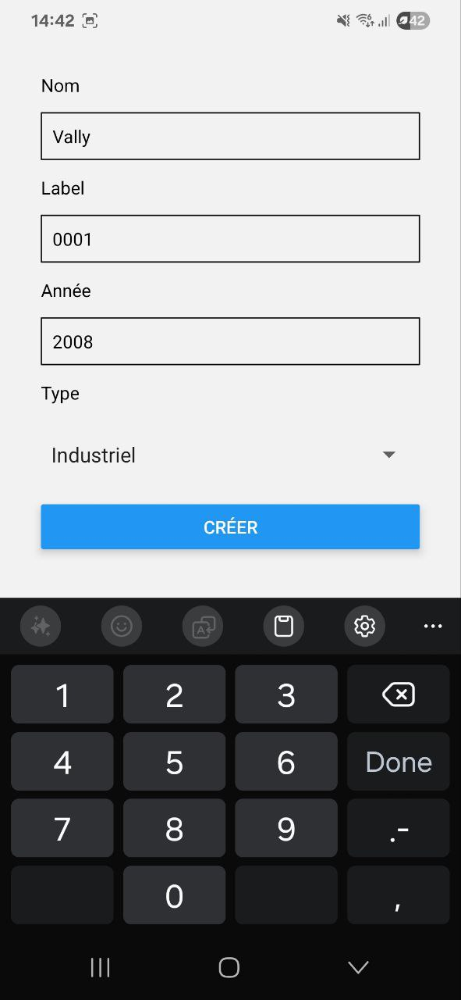

# RN Advanced Labs

- **Launch the project** : `npx expo start`
- **Launch & clear the cache** : `npx expo start -c`
- **Restart working project** : `r`

---
## TP 1


---

## TP 2 - Navigation, Persistance & Deep Linking avec Expo Router

### Le schéma d'arborescence :  


### Routes (Nom, URL, paramètres)

| Nom | URL | Paramètres |
|---|---|---|
| Home | `/home` | - |
| Profile Card | `/tp1-profile-card` | - |
| Detail | `/detail/[id]` | `id` (string) |


---

## TP3 — Formulaires avancés : Formik+Yup ET RHF+Zod

### Comparatif: Formik vs React Hook Form (RHF)

| Critère | Formik | React Hook Form |
|---|---|---|
| Expérience dev (DX) | API familière (Formik + Yup), mental model "form state global"; facile à appréhender | API basée sur hooks, approche "uncontrolled"; nécessite un petit temps d’adaptation |
| Perf perçue | Peut sembler moins fluide sur de gros forms (state global + re-rendus) | Très fluide grâce aux refs non contrôlées et subscription fine |
| Re-rendus | Les updates (p.ex. `setFieldValue`) déclenchent souvent des re-rendus du form et des champs | Les champs non observés ne re-rendent pas; re-rendus ciblés via subscriptions |
| Aide du typage TS | Typage correct via generics, validation surtout déléguée à Yup | Bonne intégration TS, surtout avec Zod |
| Verbosité | Plutôt verbeux (boilerplate: `initialValues`, `onSubmit`, `validationSchema`, handlers) | Moins verbeux (registre via `register`, `handleSubmit`, schemas Zod typés) |


### Le schéma d'arborescence :  


### Routes (Nom, URL, paramètres)

| Nom          | URL                 | Paramètres    |
| ------------ | ------------------- | ------------- |
| Home         | `/home`             | -             |
| Profile Card | `/tp1-profile-card` | -             |
| Detail       | `/detail/[id]`      | `id` (string) |
| Formik Form  | `/TP3-forms/formik` | -             |
| RHF Form     | `/TP3-forms/rhf`    | -             |

<p float="left">
  
  
</p>

---

## TP 4 (a) - Robots

### Choix de Formik + Yup

Pour ce projet, j’ai choisi Formik (gestion de formulaires) associé à Yup (validation de schémas) plutôt que d’autres solutions comme React Hook Form + Zod.
La raison principale est la simplicité : le formulaire est relativement basique et ne nécessite pas les optimisations avancées offertes par RHF (performances sur des centaines de champs, intégration très fine avec le cycle de rendu).
Formik + Yup offrent une syntaxe très lisible, facile à maintenir dans un contexte pédagogique ou de démonstration, et couvrent largement les besoins d’un CRUD simple comme celui-ci.

### Arborescence


## Routes Robots

| Nom        | URL                       | Paramètres          |
|------------|---------------------------|---------------------|
| Liste      | `/tp4-robots`             | -                   |
| Création   | `/tp4-robots/create`      | -                   |
| Édition    | `/tp4-robots/edit/[id]`   | `id` (string, uuid) |
| Suppression| `/tp4-robots` *(depuis la liste)* | `id` (string, uuid) |


### Règles de validation

Les règles métiers sont centralisées dans `robotSchema.ts` avec **Yup** :

- `name` : chaîne, **min 2 caractères**, obligatoire, **unique** dans la collection  
- `label` : chaîne, **min 3 caractères**, obligatoire  
- `year` : entier, compris entre **1950** et **année courante**, obligatoire  
- `type` : enum, une valeur parmi :  
  - `industrial` → Industriel  
  - `service` → Service  
  - `medical` → Médical  
  - `educational` → Éducatif  
  - `other` → Autre  

La contrainte d’unicité du `name` est vérifiée dans le **store Zustand** (`createRobot` et `updateRobot`).  

### Persistance avec Zustand

Le store Zustand (`robotsStore.ts`) utilise le middleware `persist` avec **AsyncStorage** pour garantir la persistance locale :

- Tous les robots sont sauvegardés automatiquement sur l’appareil (clé `robots-storage`)  
- À chaque redémarrage de l’app, la collection est restaurée depuis le cache  
- CRUD implémenté :  
  - `createRobot(data)` → ajout d’un robot (avec `uuidv4()` auto)  
  - `updateRobot(id, data)` → modification avec règles de validation  
  - `deleteRobot(id)` → suppression par identifiant  
  - `getRobotById(id)` → recherche d’un robot  

### Plan de tests manuels

Les tests suivants ont été effectués pour valider le fonctionnement du CRUD :

1. **Création d’un robot valide** ✅  
   - Saisie d’un `name`, `label`, `year`, `type`  
   - Résultat : robot ajouté à la liste, persistant après reload  

2. **Validation des contraintes** ✅  
   - `name` < 2 caractères → message d’erreur affiché  
   - `label` < 3 caractères → message d’erreur affiché  
   - `year` < 1950 ou > année courante → rejet avec message d’erreur  
   - `name` déjà utilisé → rejet avec message d’erreur  

3. **Édition d’un robot existant** ✅  
   - Changement du `label` et `year`  
   - Résultat : mise à jour visible dans la liste, persistance OK  

4. **Suppression d’un robot** ✅  
   - Clic sur l’icône 🗑  
   - Résultat : robot supprimé de la liste, modal “Robot supprimé avec succès” affiché, persistance confirmée  

5. **Persistance au redémarrage** ✅  
   - Ajout de plusieurs robots  
   - Fermeture et relance de l’app  
   - Résultat : les robots sont toujours présents  


### Captures d'écran

<p float="left">
  
  
  
  
  
</p>

---

## TP 4 (b) - Robots avec Redux

### Arborescence
```
app/
└─ (main)/
   └─ tp4-robots-rtk/
      ├─ _layout.tsx
      ├─ index.tsx(FlatList + edit + delete + FAB)
      ├─ create.tsx
      └─ edit/
         └─ [id].tsx

tp4-store-rtk/
├─ store.ts
├─ rootReducer.ts
└─ hooks.ts

features/
└─ robots/
   └─ tp4-robots-rtk/
      ├─ robotsSlice.ts
      └─ selectors.ts

components/
└─ tp4-robots-rtk/
   ├─ RobotForm.tsx
   └─ RobotListItem.tsx

validation/
└─ tp4-robots-rtk/
   └─ robotSchema.ts

```

